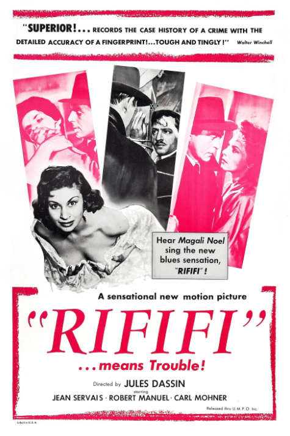
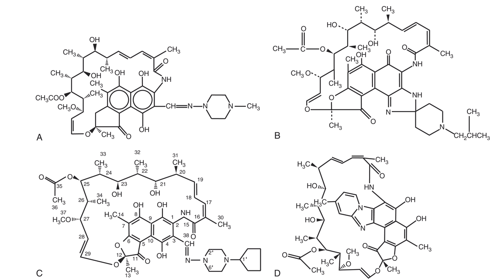
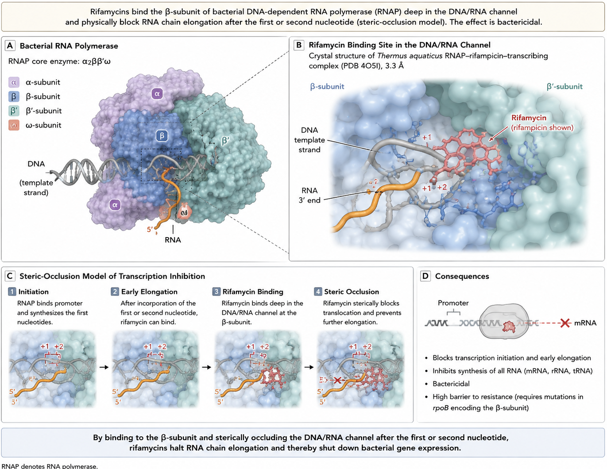
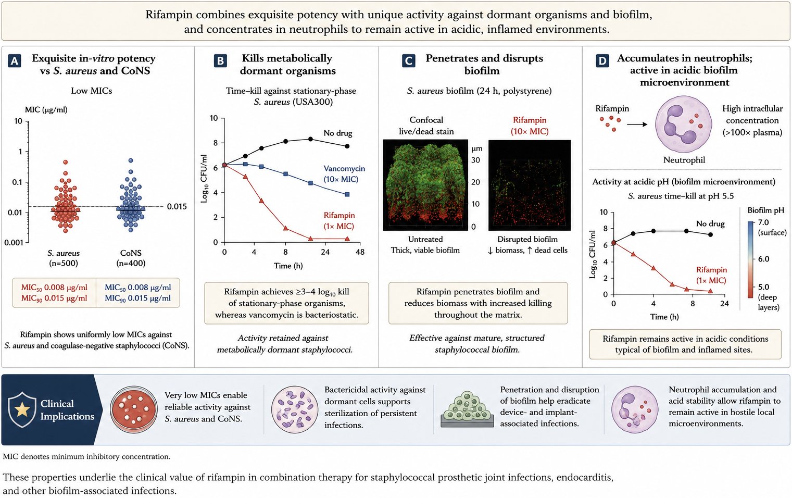

[Link to HTML slides]( )  
[Link to recorded presentation]()

## Overview

The rifamycin class of antibiotics acts through inhibition of RNA synthesis by high-affinity binding to the DNA-dependent RNA polymerase of prokaryotes. Spontaneous resistance develops readily, which limits use as monotherapy. Although the rifamycins differ in their pharmacokinetics and adverse reactions, most share significant drug interactions, especially through induction of CYP3A4. In addition to the traditional uses in mycobacterial and staphylococcal infections, newer indications for both rifampin and unique rifamycins such as rifaximin have emerged, including the treatment of gastrointestinal infections and disorders [@Forrest2010; @Koo2010].

The rifamycins were isolated by Sensi and colleagues at the Dow-Lepetit Research Laboratories in Milan in 1959 as a mixture of five substances from fermentation cultures of the organism now classified as *Amycolatopsis mediterranei*. The nickname for the drug, "Rififi," was taken from the title of a French crime film popular at the time and became the root of the class name. Rifamycin SV, the first rifamycin used clinically in 1963, was replaced by rifampicin (rifampin) in 1968 because of its improved bioavailability and greater activity against gram-positive and gram-negative bacteria and, especially, *Mycobacterium tuberculosis* [@Sensi1983; @Forrest2010].

{#fig-riffi fig-align="center" width="220"}

::: {.callout-note}
## The four approved rifamycins
**Rifampin** — the systemic workhorse; broadest use in TB and staphylococcal/biofilm infection. **Rifabutin** — long half-life, less potent CYP induction; preferred with HIV protease inhibitors. **Rifapentine** — long half-life, enables once-weekly/short-course LTBI therapy. **Rifaximin** — negligibly absorbed, gut-selective; used for hepatic encephalopathy, travelers' diarrhea, IBS.
:::

## Structure and Mechanism of Action

The rifamycins belong to the ansamycin family (from the Latin *ansa*, "handle") because of their basket-like structure: an aliphatic chain bridging two ends of a naphthoquinone core. Rifampin is the 3-(4-methyl-1-piperazinyl)-iminomethyl derivative of rifamycin SV. Small structural modifications to this shared scaffold produce the four clinically used agents shown in @fig-structures, with disproportionately large differences in pharmacokinetics.

{#fig-structures fig-align="center" width="500"}

The antibacterial action of the rifamycins results from high-affinity binding to the DNA-dependent RNA polymerase of prokaryotes (RNAP) and inhibition of RNA synthesis. The crystal structure of the *Thermus aquaticus* core RNAP in complex with rifampin (3.3 Å resolution) showed that rifampin binds a site on the β-subunit deep within the DNA/RNA channel, in a position that physically hinders the growing oligonucleotide chain after the first or second elongation step. This "steric-occlusion model" holds that rifamycins sterically block synthesis of any RNA product longer than 2–3 nucleotides [@Campbell2001]. An alternative allosteric model proposed by Artsimovitch and colleagues holds that rifamycins additionally disfavor binding of the Mg²⁺ ion in the active site, slowing catalysis and facilitating dissociation of short transcripts [@Artsimovitch2005]; this allosteric mechanism remains controversial [@Mosaei2008].

{#fig-moa fig-align="center" width="650"}

::: {.callout-important}
## Why selectivity is high
Eukaryotic RNA polymerases do not bind rifamycins, so inhibition is selective for the prokaryotic enzyme. Human mitochondrial RNA polymerase is also insensitive at therapeutic concentrations. This underlies the drug's favorable therapeutic index despite acting on a fundamental cellular process.
:::

## Mechanisms of Resistance

Rifampin is highly bactericidal against *M. tuberculosis* and is a first-line agent, but exposed bacteria develop resistance at a rate of roughly 10⁻⁸ to 10⁻⁹ per bacterium per cell division. Mutations conferring resistance are confined almost exclusively to the *rpoB* gene and reduce the affinity of RNAP for the drug. More than 95% of rifampin-resistant *M. tuberculosis* clinical strains carry a mutation in an 81-base-pair region of *rpoB* — the **rifampin resistance-determining region (RRDR)** — spanning codons 507–533. Most strains have an amino acid replacement at codon 526 or a missense mutation at codon 531; substitutions at these positions confer high-level resistance to rifampin, rifabutin, and rifapentine [@Ramaswamy1998; @Ohno1996]. The mechanism in the ~4% of resistant isolates that lack RRDR changes is unknown.

Alternative mechanisms include impaired cellular uptake (*Pseudomonas fluorescens*); antibiotic modification by ADP-ribosylation via the *arr* gene (*Mycobacterium smegmatis*, and an *arr-2* gene on plasmids in *Enterobacterales* including *Klebsiella pneumoniae* and *P. aeruginosa*); and intrinsically less susceptible enzyme in species such as *Nocardia* [@Floss2005].

::: {.callout-tip}
## Clinical Pearl — the single-mutation problem
Because a single point mutation in *rpoB* confers high-level resistance, rifamycin monotherapy selects resistant mutants rapidly whenever the bacterial burden is high (cavitary TB, abscesses, endocarditis, biofilm). This is the central reason rifamycins are almost always used in combination.
:::

### Molecular detection of resistance

Delineation of these mechanisms enabled PCR-based rapid detection. The **Xpert MTB/RIF** assay (a heminested PCR) detects *M. tuberculosis* and rifampin resistance by probing the RRDR of *rpoB*, returning results from a single sputum specimen within ~2 hours with minimal biosafety requirements [@Helb2010]. It has been validated as highly sensitive and specific for pulmonary TB and rifampin resistance [@Steingart2014] and is now recommended by the WHO, including for extrapulmonary disease [@WHO2013Xpert]. Line-probe assays (GenoType MTBDRplus, INNO-LiPA Rif) are alternatives; in systematic review all performed well, with Xpert showing the highest sensitivity and best cost-effectiveness [@Drobniewski2015]. Because rifampin resistance prevalence is low in some settings, a positive genotypic result should be confirmed by sequencing and culture-based testing, since discrepant genotypic-resistant/phenotypic-susceptible results account for at least 10% of molecular-test resistance diagnoses.

## Shared Pharmacology of the Rifamycins

The rifamycins are highly lipophilic compounds sharing a common core but differing in pharmacokinetics (@tbl-pk). The systemic rifamycins — rifampin, rifabutin, and rifapentine — have long postantibiotic effects against *M. tuberculosis* of 68–75 hours. They are metabolized in hepatocytes and intestinal microsomes to deacetylated, hydroxylated, and formyl derivatives; the parent drug and the active 25-*O*-deacetyl metabolite are excreted in bile and eliminated in feces. Repeated administration of rifampin and rifabutin causes **autoinduction** of gut/hepatic metabolism, decreasing the AUC of both drugs [@Burman2001]. Despite a notable adverse-reaction profile, the overall incidence of drug discontinuation was only 1.9% in a large retrospective study, with more than half of discontinuations judged unnecessary [@Cook2000].

| Drug | Bioavailability (%) | t~max~ (hr) | C~max~ (µg/mL) | t~½~ (hr) | Protein binding (%) |
|------|:---:|:---:|:---:|:---:|:---:|
| Rifampin | 68 | 1.5–2 | 8–20 | 2–5 | 80 |
| Rifabutin | 20 | 2.5–4 | 0.2–0.9 | 32–67 | 72–85 |
| Rifapentine | 70 (with food) | 4.8–6.6 | 8–30 | 14–18 | 98 |
| Rifaximin | <0.4 | 0.8–1 | 3.4 ± 1.6 ng/mL | 1.8–4.8 | 62–67.5 |

: Comparative pharmacokinetics of the rifamycins in healthy adults. Adapted from Burman et al. and Blaschke & Skinner [@Burman2001; @Blaschke1996]. {#tbl-pk}

### Drug interactions

Drug-drug interactions are common and clinically important. Rifampin is the most potent inducer of hepatic and intestinal enzymes — especially **CYP3A4**, but also CYP1A2, CYP2C, CYP2D6, and drug transporters such as P-glycoprotein. Maximal induction occurs roughly one week after starting therapy and resolves over ~2 weeks after stopping. Induction lowers the AUC/C~max~ of numerous co-administered drugs, often requiring dose adjustment or an alternative agent (@tbl-interactions) [@Baciewicz2013]. Recent additions to the interaction list include HIV integrase inhibitors, direct-acting antivirals for HCV, and ritonavir-boosted protease inhibitors used for SARS-CoV-2. Antiretroviral interactions are detailed in the DHHS guidelines [@DHHS_ARV].

| Category | Representative interacting drugs |
|----------|----------------------------------|
| Anticoagulants | Warfarin, clopidogrel, dabigatran, rivaroxaban, apixaban |
| Antimicrobials | Azoles, clarithromycin, doxycycline, linezolid, atovaquone, caspofungin, HCV DAAs, HIV integrase inhibitors/NNRTIs/protease inhibitors, nirmatrelvir/ritonavir |
| Cardiovascular | β-blockers, calcium channel blockers, digoxin, quinidine, disopyramide, losartan |
| Endocrine | Oral contraceptives, glucocorticoids, sulfonylureas, levothyroxine, tamoxifen, statins |
| Immunosuppressants | Cyclosporine, tacrolimus, sirolimus, mycophenolate mofetil |
| Neuropsychiatric | Benzodiazepines, phenytoin, haloperidol, clozapine, methadone |
| Opioids/analgesics | Methadone, fentanyl (transdermal), oxycodone, buprenorphine |

: Major rifamycin drug interactions (selected). Modified from Baciewicz et al. [@Baciewicz2013]. {#tbl-interactions}

::: {.callout-warning}
## Practical interaction management
Rank of CYP3A4 induction: **rifampin > rifapentine > rifabutin**. When a strong interaction cannot be tolerated (e.g., an HIV protease-inhibitor regimen), substituting **rifabutin** (with dose adjustment) is the standard workaround. Counsel patients that oral contraceptives may fail and that body fluids (urine, tears, sweat) and soft contact lenses turn red-orange.
:::

## Rifampin

### Pharmacokinetics

Rifampin is dosed at 600 mg daily in adults (10–20 mg/kg in children). Absorption is rapid and complete and is improved on an empty stomach. It is the only rifamycin available intravenously, and it distributes widely to most tissues and fluids, including CSF (mean ~2 µg/mL at 20 mg/kg in children) and bone; it crosses the placenta and enters breast milk. Elimination is via enterohepatic circulation and biliary excretion after deacetylation; urinary excretion is 13–24%, so no dose adjustment is needed in renal insufficiency, whereas severe hepatic impairment warrants adjustment [@Burman2001].

### Adverse reactions

Allergic reactions occur in 0.01–0.26% and are more common with prior or intermittent dosing. A **flu-like syndrome** (fever, chills, myalgias, headache) is most typical of intermittent, higher-dose regimens and is immune-complex mediated; switching to daily dosing usually abolishes it [@Martinez1999]. **Acute renal failure** (usually acute interstitial nephritis) is associated with intermittent dosing and antirifampin antibodies; recovery is usually complete after stopping the drug [@DeVriese1998]. Immune-mediated **thrombocytopenia and hemolysis** may accompany renal toxicity, and rare cases of DIC have been reported. Hepatic effects are usually mild and cholestatic; serious injury is largely confined to patients with underlying liver disease or concomitant hepatotoxins such as isoniazid. Reported hepatotoxicity from rifampin alone is ~1.1% [@Yew2006], but the combination with isoniazid (and especially with pyrazinamide for LTBI) increases risk [@MMWR2001Hepatic]. An *SLCO1B1* \*15 haplotype predisposes to rifampin-induced liver injury [@Li2012].

### Antimicrobial activity

Although associated with TB, rifampin has broad antibacterial activity (@tbl-mic). It is most potent against gram-positive organisms — *S. aureus*, coagulase-negative staphylococci, *Streptococcus pyogenes*, *S. pneumoniae*, viridans streptococci, *C. difficile*, and *Listeria monocytogenes* — with useful activity against *Haemophilus influenzae*, *Neisseria meningitidis*, and *Helicobacter pylori* [@Thornsberry1983]. It shows synergy in vitro with other agents against MDR *P. aeruginosa* and *Acinetobacter baumannii*, and it is active against intracellular pathogens (*Chlamydia*, *Legionella*, *Brucella*, *Bartonella*). It is active against nontuberculous mycobacteria including MAC, *M. kansasii*, and *M. marinum*.

| Organism | MIC range (µg/mL) | MIC~50~ | MIC~90~ |
|----------|:---:|:---:|:---:|
| *Staphylococcus aureus* | 0.008–0.015 | 0.015 | 0.015 |
| *Staphylococcus epidermidis* | 0.004–0.015 | 0.015 | 0.015 |
| Group A streptococci | 0.03–0.12 | 0.12 | 0.12 |
| *Streptococcus pneumoniae* | 0.06–32 | 0.12 | 0.12 |
| *Enterococcus faecalis* | 1–8 | 2 | 8 |
| *Haemophilus influenzae* | 0.5–64 | 1 | 1 |
| *Neisseria meningitidis* | 0.015–1 | 0.03 | 0.5 |
| *Listeria monocytogenes* | 0.12–0.25 | <0.12 | 0.25 |
| *Escherichia coli* | 8–16 | 8 | 16 |
| *Klebsiella pneumoniae* | 16–32 | 32 | 32 |
| *Clostridioides difficile* | 0.10 to >100 | 1.56 | >100 |
| *Pseudomonas aeruginosa* | 32 to >64 | 32 | 64 |
| *Mycobacterium tuberculosis* | 0.06–0.25 | 0.25 | 0.25 |
| *M. avium-intracellulare* | 0.78 to >100 | 6.25 | 50 |
| *M. kansasii* | 0.025–3.13 | 0.2 | 3.13 |
| *Legionella* spp. | 0.001–0.5 | <0.25 | 0.125 |
| *Bartonella* spp. | 0.03–0.06 | 0.12 | 0.25 |
| *Brucella* spp. | 0.5–1 | 2 | 4 |
| *Helicobacter pylori* | 0.125–0.75 | 0.25 | 0.125 |

: Antimicrobial activity of rifampin against representative organisms [@Thornsberry1983]. {#tbl-mic}

### Immune-modulating effects

Beyond bactericidal activity, rifampin has immunomodulatory properties in vitro — inhibition of IL-1β and TNF-α with increases in IL-6 and IL-10 in stimulated monocytes, and cytoprotective effects (e.g., reduced neuronal loss in experimental pneumococcal meningitis). The clinical significance remains investigational.

## Rifabutin

Rifabutin is a spiropiperidyl rifamycin analogue with a larger volume of distribution and a long terminal half-life (~35 hr), permitting once-daily dosing. It is more lipid-soluble than rifampin and extensively tissue-distributed; ~53% is excreted in urine as the active C-25 desacetyl metabolite, so a dose reduction is advised for creatinine clearance <30 mL/min [@Blaschke1996]. Crucially, rifabutin is a **weaker inducer of CYP3A4** than rifampin, which underlies its preference in patients on HIV protease inhibitors. Because protease inhibitors raise rifabutin concentrations, the rifabutin dose is reduced (to 150 mg daily with a ritonavir-boosted PI); with efavirenz it is increased (to 450–600 mg daily).

Rifabutin has a distinctive toxicity profile including **uveitis, leukopenia, and polyarthralgias**. Uveitis is dose- and interaction-dependent (higher rifabutin levels, e.g., with clarithromycin or fluconazole), may mimic infectious endophthalmitis with hypopyon, and responds to corticosteroids and cycloplegics [@Griffith1995]. Rifabutin is active against *M. tuberculosis*, MAC, and *H. pylori*; a rifabutin-based rescue regimen (with amoxicillin and a PPI) is effective for refractory *H. pylori* infection [@Graham2020].

## Rifapentine

Rifapentine, a cyclopentyl rifamycin, is more potent (MIC 0.06 vs 0.25 µg/mL for *M. tuberculosis*) and longer-acting than rifampin (half-life 14–18 hr) [@Heifets1990; @Jarvis1998]. It should be taken with food (a high-fat meal increases serum concentration by ~50%). It is metabolized by esterases to the 25-desacetyl metabolite and induces CYP3A4/CYP2C, interacting with the same drugs as rifampin. Rifapentine is better tolerated than rifampin, with a lower incidence of flu-like syndrome, though hyperuricemia occurs in up to 21%. Its antimicrobial activity is essentially limited to *M. tuberculosis*. Its long half-life makes it the enabling drug for once-weekly and ultrashort LTBI regimens.

## Rifaximin

Rifaximin has an additional ring linking the C-3 and C-4 positions. Oral absorption is minimal (<0.01% detectable in plasma; ~97% recovered unchanged in stool), producing very high fecal concentrations (~8000 µg/mL) and negligible systemic toxicity or drug interactions [@Koo2010]. In cirrhosis, systemic exposure rises (AUC increases 10–20×), but no dose adjustment is required. Rifaximin is bactericidal against enterotoxigenic/enteroaggregative *E. coli*, *Salmonella*, *Shigella*, *Campylobacter*, and *C. difficile*, with antiprotozoal activity against *Cryptosporidium parvum* and *Blastocystis hominis* [@DuPont2011]. Beyond direct antibacterial effect, it modulates the gut microbiome and downregulates NF-κB-mediated inflammation.

## Clinical Uses

### Tuberculosis

Since its introduction, rifampin has been a cornerstone of TB therapy: adding rifampin to combination regimens reduced treatment duration from 18 to 9 months, and rifampin-resistant disease requires longer treatment with higher failure rates [@Goble1993]. Rifampin has the most potent **sterilizing activity** among first-line agents (the ability to kill dormant persisters) and penetrates cavitary lesions well; it remains the first-line rifamycin because it is inexpensive, globally available, and has a long safety record [@Alfarisi2017]. International guidelines dose it at 10 mg/kg (max 600 mg), but these targets rest on historical PK/toxicity/cost arguments that newer data have challenged.

Rifampin killing of *M. tuberculosis* is concentration-dependent and correlates with the AUC/MIC ratio [@Gumbo2007; @Jayaram2003]. Early-bactericidal-activity and dose-ranging studies show that **higher doses** (up to 35 mg/kg) are safe and shorten time to culture conversion, raising the prospect of shorter regimens [@Boeree2015; @Boeree2017]. Translating this into practice has proven harder than the pharmacology suggested: the phase 3 **RIFASHORT** trial tested 4-month regimens using flat doses of 1200 mg and 1800 mg daily against the standard 6-month regimen. Both experimental doses were safe, without dose-limiting toxicity, but neither met the prespecified noninferiority margin [@Jindani2023RIFASHORT]. WHO is actively reconsidering global rifampin dosing guidance, and there is not yet consensus on whether the standard starting dose should change.

Alternatives to rifampin in TB: **rifapentine** enables intermittent therapy, but once-weekly rifapentine-isoniazid in the continuation phase was associated with relapse and acquired rifamycin monoresistance in HIV-positive patients, so it should not be used intermittently in HIV [@Benator2002]; higher-dose daily rifapentine is under study to shorten therapy [@Jindani2014; @Dooley2012]. **Rifabutin** has similar efficacy to rifampin and is preferred in HIV coinfection on protease-inhibitor–based ART because of its weaker enzyme induction.

### Special populations and dosing individualization

Standard rifampin dosing was derived largely from 1970s-era manufacturing cost and supply constraints rather than a defined efficacy ceiling, and several populations illustrate where that standard dose may be mismatched to need. In **tuberculous meningitis**, rifampin achieves cerebrospinal fluid concentrations well below plasma levels, and higher doses were hypothesized to improve outcomes. The **HARVEST trial** — a randomized, placebo-controlled study of 499 adults across Indonesia, South Africa, and Uganda — found that high-dose oral rifampicin (35 mg/kg for 8 weeks) did **not** improve 6-month survival compared with standard dosing (10 mg/kg); mortality was numerically higher, not lower, in the high-dose arm (44.6% vs. 40.7%; hazard ratio 1.17, 95% CI 0.89–1.54) [@Meya2025HARVEST]. For ***M. avium* complex**, the MIC distribution is right-shifted by roughly two dilutions relative to *M. tuberculosis*, raising the question — not yet guideline-endorsed — of whether standard TB dosing is adequate for MAC disease. Malabsorption from bariatric surgery, HIV enteropathy, or interacting medications can also produce unexpectedly low rifampin exposure; paired plasma sampling (e.g., at 2 and 6 hours, or 3 and 7 hours post-dose) via therapeutic drug monitoring can identify and help correct this in individual patients, though escalation thresholds are not standardized across programs.

### Latent tuberculosis infection

Shorter rifamycin-based regimens have largely displaced 9 months of isoniazid because of better completion and lower hepatotoxicity. Options include 4 months of daily rifampin; 3–4 months of daily isoniazid + rifampin; and the once-weekly isoniazid + rifapentine regimen for 12 weeks (**3HP**), shown to be as effective as 9 months of isoniazid with higher completion and fewer severe events [@Sterling2011]. Network meta-analysis found comparable efficacy across regimens, with the shorter (3–4 month) regimens more likely to be completed [@Pease2017]. In people with HIV, a **1-month** daily rifapentine + isoniazid regimen (**1HP**) was noninferior to 9 months of isoniazid with higher completion [@Swindells2019].

### Nontuberculous mycobacteria

For MAC pulmonary disease, ATS/IDSA recommend macrolide + rifampin (or rifabutin) + ethambutol, with rifabutin favored in disseminated disease or with significant drug interactions; adding rifabutin as a third drug improved survival and reduced relapse in AIDS-associated MAC bacteremia [@Griffith2007; @Benson2003]. Rifampin-containing regimens are also standard for *M. kansasii* (with isoniazid and ethambutol) [@Griffith2007].

### Leprosy

Rifampin is rapidly bactericidal against *M. leprae* and is central to WHO multidrug therapy — with dapsone for paucibacillary disease and with dapsone + clofazimine for multibacillary disease [@Bullock1983; @Rodrigues2011]. Single-dose rifampin reduces leprosy incidence among close contacts [@Moet2008]. It must never be used as monotherapy because resistance develops rapidly.

### Staphylococcal infections and the role of biofilm

Rifampin is potently bactericidal in vitro against *S. aureus* and CoNS and, uniquely, is active against metabolically dormant organisms and penetrates biofilm — the pharmacologic basis for its use in device-associated infection [@Mandell1983; @Costerton1999]. But monotherapy fails rapidly through resistance, so rifampin is always used in combination [@Sande1975].

{#fig-rifampin-sa fig-align="center" width="700"}

::: {.callout-warning}
## A caveat on in-vitro synergy data
Much of the mechanistic case above — and combination-therapy rationales generally — rests on in-vitro synergy testing (time-kill, checkerboard, or gradient-diffusion methods). These methods are not standardized by CLSI, show only modest agreement with one another, and no randomized controlled trial has shown that synergy testing predicts clinical outcome in staphylococcal infection [@Doern2014]. In-vitro synergy also does not reliably predict in-vivo benefit — the reverse (antagonism in vivo despite in-vitro synergy, or vice versa) has been observed. The mechanistic rationale is worth understanding, but should not be mistaken for bedside-validated evidence.
:::

For **native valve endocarditis** and uncomplicated *S. aureus* bacteremia, adding rifampin has not improved outcomes and selects for resistance; IDSA and AHA guidelines recommend **against** routine rifampin in staphylococcal NVE [@Baddour2015; @Liu2011]. In surgically treated staphylococcal endocarditis, adjunctive rifampin conferred no reoperation-free or survival benefit [@Shrestha2016], and a meta-analysis found insufficient evidence to support adjunctive rifampin for *S. aureus* bacteremia [@Ma2020] — though a retrospective cohort suggested benefit when a deep focus is present [@Forsblom2015].

For **prosthetic valve endocarditis** caused by staphylococci, rifampin remains part of triple therapy (e.g., vancomycin + rifampin + gentamicin) [@Karchmer1983]. This recommendation, however, rests on limited evidence: it traces to a single observational study from the 1980s that was never confirmed by a randomized trial. A 2022 systematic review and meta-analysis of the four available studies found **no clinical benefit** of adjunctive rifampin (or gentamicin) in staphylococcal PVE, and the authors called for the guideline recommendation to be critically reevaluated pending a proper trial [@Ryder2022]. In practice, many clinicians report using adjunctive rifampin in PVE "with little conviction" and readily substitute another approach when drug interactions or intolerance provide a reason to.

::: {.callout-tip}
## Clinical Pearl — where rifampin genuinely helps: orthopedic device infection
The landmark Zimmerli FBI Study Group RCT showed that adding rifampin to ciprofloxacin for stable orthopedic implant-related staphylococcal infection managed with debridement and retention markedly improved cure [@Zimmerli1998]. Cohort data support rifampin combinations in prosthetic joint infection managed with debridement and implant retention [@ElHelou2010; @Peel2013], and a randomized trial addressed the optimal duration of levofloxacin + rifampin [@LoraTamayo2016]. A large multicentre observational study refined *if, when, and how* to add rifampin in acute staphylococcal PJI [@Beldman2021]. The unifying principle: rifampin's value is greatest against **retained hardware and biofilm**, not free-floating bacteremia.
:::

When rifampin is used for staphylococcal bone and joint infection, the multicentre French **EVRIOS** trial (543 patients) found that a simple 10 mg/kg daily dose was **noninferior** to 20 mg/kg, with more severe adverse events in the higher-dose arm — supporting a straightforward, well-tolerated dosing strategy rather than aggressive per-kilogram escalation [@Arvieux2025EVRIOS]. Fluoroquinolone + rifampin remains the only companion-drug combination with genuine trial support (the Zimmerli paradigm above); doxycycline + rifampin is used in practice but lacks controlled-trial evidence, and rifampin's induction of doxycycline clearance is of uncertain clinical significance.

::: {.callout-warning}
## When to add rifampin — and when not to
**Add** for retained prosthetic material/biofilm (PJI managed with retention, PVE), once the bacteremia is controlled and the isolate is susceptible. **Avoid** in uncomplicated *S. aureus* bacteremia and native valve endocarditis. **Never** start rifampin into a high-burden bacteremia before source control — do so and you invite resistance. Wait until blood cultures clear before adding it.
:::

When rifampin is indicated but a high-risk drug interaction exists (e.g., methadone, anticoagulants), **rifabutin** is a plausible substitute given its shared mechanism and weaker CYP3A4 induction. A retrospective single-center study of staphylococcal prosthetic joint infection found that only 3.4% of patients who met criteria for rifampin therapy had a drug interaction that would also contraindicate rifabutin, compared with 18.4% for rifampin itself — and completing rifampin therapy was associated with better treatment success and lower revision risk [@Leal2025Rifabutin]. This remains single-center, retrospective evidence rather than a head-to-head efficacy comparison, but it supports rifabutin substitution as a reasonable workaround rather than abandoning combination therapy altogether.

### VISA/VRSA and *rpoB*

*rpoB* mutations that reduce vancomycin susceptibility also frequently confer rifampin resistance, linking vancomycin exposure and rifampin resistance in *S. aureus* [@Watanabe2011]. Rifampin was active against 92% of VRSA but only 51% of VISA isolates in one series.

### Chemoprophylaxis and device-related prevention

Rifampin (600 mg twice daily for 2 days) eradicates meningococcal carriage in 75–95% of carriers, but resistance emergence during outbreaks favors ceftriaxone or ciprofloxacin. Rifampin (20 mg/kg in children, 600 mg in adults, daily for 4 days) is used for *H. influenzae* type b contact prophylaxis. **Rifampin-minocycline-impregnated catheters** reduce catheter-related bacteremia; the CATCH trial found a 57% reduction in bloodstream infection versus standard catheters in children [@CATCH2016]. An antibacterial **envelope** eluting rifampin and minocycline reduced major cardiac implantable electronic device infections in the WRAP-IT randomized trial (hazard ratio 0.60) [@Tarakji2019].

### Rifaximin: gut-selective indications

Rifaximin (550 mg twice daily) is approved to prevent **hepatic encephalopathy**, reducing breakthrough episodes and HE-related hospitalization versus placebo [@Bass2010], and is at least as effective as lactulose with better tolerability [@Paik2005]. It reduces time to symptom resolution in **travelers' diarrhea** and was ~72% effective in chemoprophylaxis, although fluoroquinolones remain preferred for prophylaxis given broader activity [@DuPont2005]. For **recurrent *C. difficile* infection**, a "rifaximin chaser" after vancomycin has response rates as high as 83%, but resistance is a concern (some isolates, disproportionately BI/NAP1/027, show high MICs) [@Garey2009; @OConnor2008]. Rifaximin is FDA-approved for IBS without constipation and may benefit inflammatory bowel disease as a steroid-sparing option [@Guslandi2011].

::: {.callout-note}
## Rifaximin resistance and the microbiome
Because rifaximin acts locally in the gut, most systemic-interaction concerns disappear — but rifampin-class resistance can still be selected. Rifampin-resistant staphylococci have been recovered from skin after rifaximin therapy, persisting up to 9 weeks, and rifaximin-resistant *E. coli* emerge in the gut. Reserve empirical courses accordingly.
:::

## Rifamycins in Development

Investigational directions include aerosolized rifampin formulations (dry powders, chitosan-coated liposomes, colistin co-formulations) to raise intracellular pulmonary concentrations; rifamycin-loaded orthopedic scaffolds and PMMA to prevent device infection; and rifamycin SV MMX, a colon-targeted, non-absorbed formulation studied for travelers' diarrhea and other GI indications. Multi-targeting conjugates aim to suppress single-mutation resistance: **TNP-2092** (a rifamycin-quinolizinone hybrid inhibiting RNA polymerase, DNA gyrase, and topoisomerase IV) showed superior efficacy to metronidazole and vancomycin in a mouse *C. difficile* model [@TNP2092], and **TNP-2198** (a rifamycin-nitroimidazole hybrid) is in clinical development for *H. pylori*, *C. difficile*, and bacterial vaginosis [@TNP2198].

## Key Teaching Points

::: {.callout-important}
## Summary
1. **Mechanism:** rifamycins inhibit prokaryotic RNA polymerase (β-subunit, *rpoB*); a single *rpoB* mutation gives high-level resistance → never use as monotherapy.
2. **CYP3A4 induction** drives most interactions; potency rifampin > rifapentine > rifabutin. Rifabutin is the workaround with HIV protease inhibitors.
3. **TB:** rifampin has the strongest sterilizing activity; rifapentine enables short-course LTBI (3HP, 1HP); rifabutin is preferred with PIs.
4. **Staph/biofilm:** rifampin's niche is **retained hardware** (PJI with retention, PVE, devices) — add only after source control and clearance of bacteremia; **avoid** in uncomplicated bacteremia/NVE.
5. **Rifaximin** is gut-selective: hepatic encephalopathy, travelers' diarrhea, IBS, recurrent CDI.
:::

## References {.unnumbered}

::: {#refs}
:::
